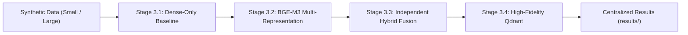
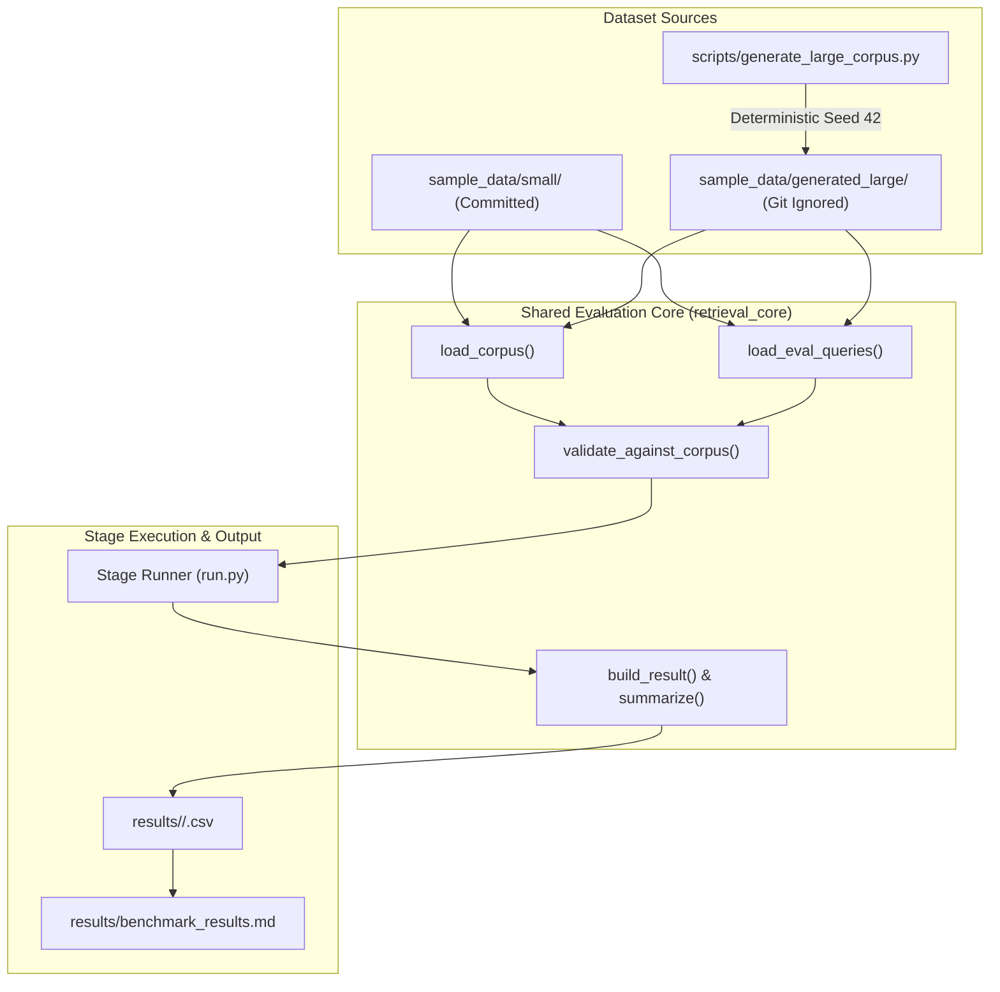
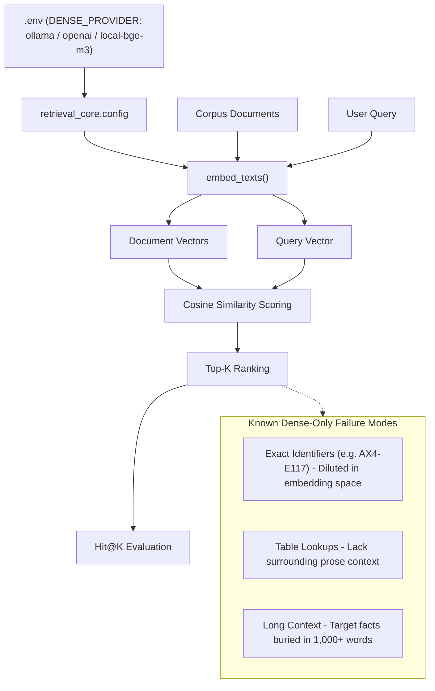
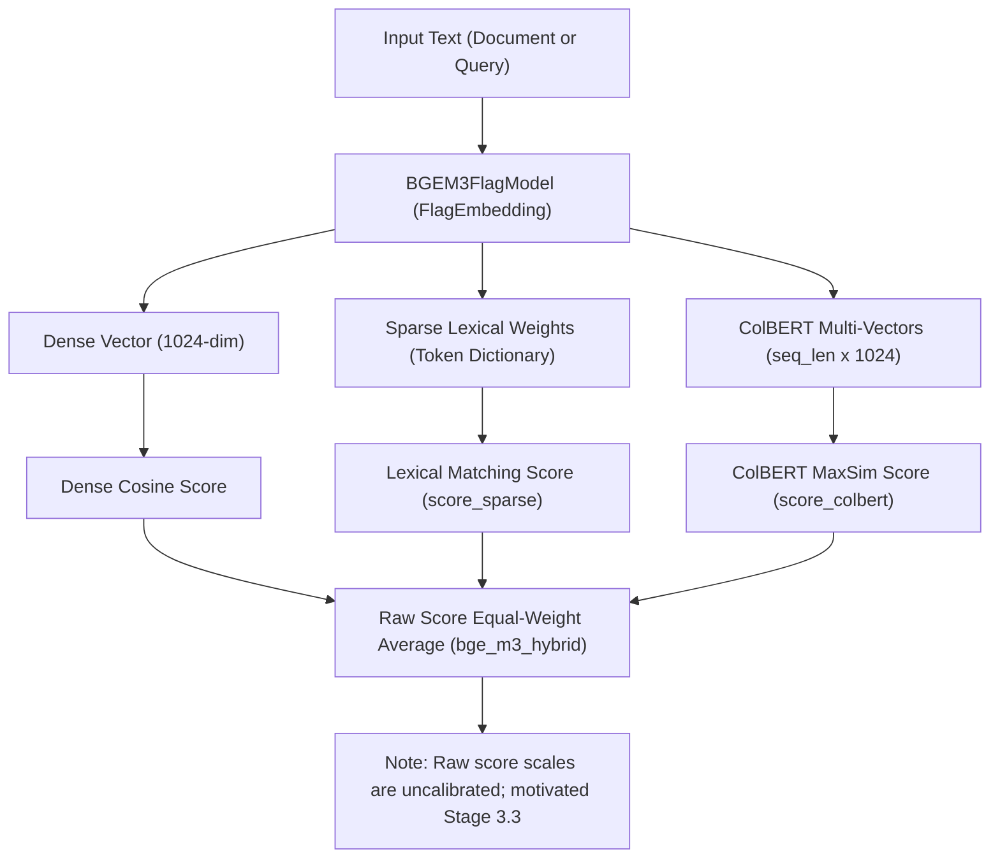
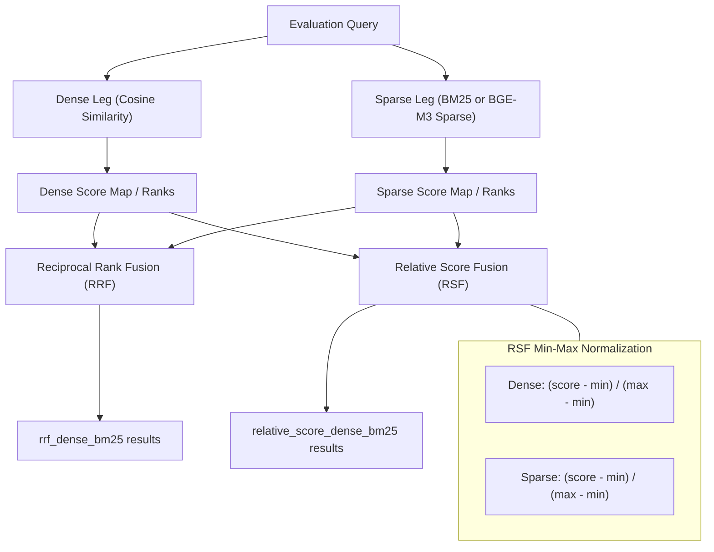
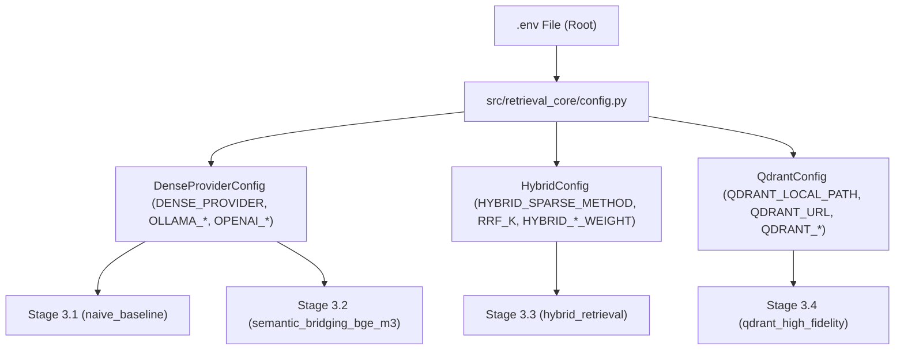

# Chapter 3 Retrieval Architecture & Workflows

This document provides architectural flowcharts and execution diagrams for each stage of Chapter 3, detailing how synthetic data, embedding models, fusion algorithms, and vector databases connect together.

---

## 1. Chapter-Stage Progression

The chapter is structured in four progressive stages. Each stage isolates a specific retrieval concept or addresses a concrete failure mode identified in the preceding step before storing results in a single consolidated directory.

- **Stage 3.1 (`naive_baseline/`)**: Demonstrates where single-vector dense retrieval fails on exact codes and tabular figures.
- **Stage 3.2 (`semantic_bridging_bge_m3/`)**: Demonstrates multi-vector representation (dense, sparse lexical weights, ColBERT) from a single model.
- **Stage 3.3 (`hybrid_retrieval/`)**: Demonstrates rank-based (RRF) and normalized-score (RSF) fusion of independent retrieval legs.
- **Stage 3.4 (`qdrant_high_fidelity/`)**: Demonstrates durable storage, payload metadata filtering, and two-stage ColBERT candidate reranking in Qdrant.

---

## 2. Dataset Lifecycle and Evaluation Workflow

The evaluation pipeline supports both a small committed test dataset and a large synthetic stress-testing corpus generated deterministically on local machines.

The large corpus contains 200 documents and 32 labeled queries. It is excluded from version control via `.gitignore` and rebuilt locally whenever needed.

---

## 3. Stage 3.1: Dense-Only Retrieval Flow

Dense-only retrieval embeds documents and queries into fixed-size semantic vectors. The diagram below illustrates how configuration flows into embedding generation and highlights the primary failure modes.

---

## 4. Stage 3.2: BGE-M3 Multi-Representation Flow

Native BGE-M3 generates three distinct representations in a single forward pass through `FlagEmbedding`.

---

## 5. Stage 3.3: Independent Hybrid Retrieval Flow

Stage 3.3 decouples dense and sparse retrieval into independent legs and combines them using formal fusion algorithms.

---

## 6. Stage 3.4: High-Fidelity Qdrant Deployment & Retrieval Flow

Stage 3.4 integrates persistent vector storage with payload metadata filtering and optional second-stage ColBERT reranking.

```mermaid
flowchart TD
    subgraph ClientFactory ["Single Connection Abstraction (client.py)"]
        EnvQ[".env Settings"] --> CF["get_qdrant_client()"]
        CF -->|QDRANT_URL unset| Emb["Embedded Local Qdrant (./.qdrant_local)"]
        CF -->|QDRANT_URL set| Rem["Remote Docker / Qdrant Cloud"]
    end

    subgraph Collection ["Collection & Schema (collection.py)"]
        Docs["Corpus Documents"] --> PGen["Generate Points (dense vector + metadata)"]
        PGen --> Col["Qdrant Collection (named 'dense' vector)"]
        Col --> Idx["Payload Indexes (document_type, failure_tags)"]
    end

    subgraph Search ["Two-Stage Retrieval (run.py)"]
        Q["Query"] --> QSearch["client.query_points()"]
        Flt["Optional Filter (document_type / failure_tags)"] --> QSearch
        QSearch --> Cand["Top 20 Finalist Candidates (qdrant_dense)"]
        Cand --> RerankCheck{"local-bge-m3 available?"}
        RerankCheck -->|Yes| ColBERT["ColBERT Token MaxSim Rerank (qdrant_dense_colbert_rerank)"]
        RerankCheck -->|No| Skip["Skip Reranking"]
    end
```

---

## 7. Configuration Ownership

All user-configurable options are centralized in the root `.env` file and loaded through `retrieval_core.config`. Application code never reads `os.environ` directly.

